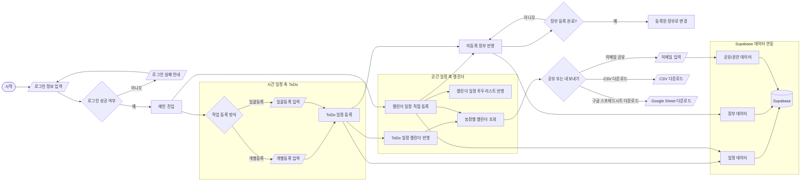

# 서비스 운영/협업 플로우차트

아래 다이어그램은 로그인 이후 `ToDo <-> 캘린더` 양방향 반영, `미등록 장부 -> 등록된 장부` 전환, 공유/내보내기, Supabase 연동 흐름을 보여줍니다.

```mermaid
flowchart LR
  S([시작]) --> I_LOGIN[/로그인 정보 입력/]
  I_LOGIN --> D_LOGIN{로그인 성공 여부}
  D_LOGIN -- 아니오 --> O_FAIL[/로그인 실패 안내/]
  O_FAIL --> I_LOGIN
  D_LOGIN -- 예 --> P_MAIN[메인 진입]

  subgraph TIME["시간 일정 축 ToDo"]
    T_METHOD{작업 등록 방식}
    T_SINGLE[/개별등록 입력/]
    T_BULK[/일괄등록 입력/]
    T_SAVE[ToDo 일정 등록]
    T_METHOD -- 개별등록 --> T_SINGLE --> T_SAVE
    T_METHOD -- 일괄등록 --> T_BULK --> T_SAVE
  end

  subgraph SPACE["공간 일정 축 캘린더"]
    C_SYNC[ToDo 일정 캘린더 반영]
    C_MANUAL[캘린더 일정 직접 등록]
    T_SYNC[캘린더 일정 투두리스트 반영]
    C_VIEW[농장별 캘린더 조회]
    C_SYNC --> C_VIEW
    C_MANUAL --> C_VIEW
  end

  P_MAIN --> T_METHOD
  P_MAIN --> C_MANUAL

  %% 요청하신 핵심 연동
  T_SAVE --> C_SYNC
  C_MANUAL --> T_SYNC

  %% 장부 자동 연동
  T_SAVE --> L_PENDING[미등록 장부 반영]
  C_MANUAL --> L_PENDING
  L_PENDING --> D_LEDGER{장부 등록 완료?}
  D_LEDGER -- 예 --> L_DONE[등록된 장부로 변경]
  D_LEDGER -- 아니오 --> L_PENDING

  %% 공유/내보내기 기능 유지
  C_VIEW --> D_SHARE{공유 또는 내보내기}
  D_SHARE -- 이메일 공유 --> SH_EMAIL[/이메일 입력/]
  D_SHARE -- CSV 다운로드 --> SH_CSV[/CSV 다운로드/]
  D_SHARE -- 구글 스프레드시트 다운로드 --> SH_GS[/Google Sheet 다운로드/]

  %% Supabase 연결 느낌
  subgraph SBX["Supabase 데이터 연동"]
    SB[(Supabase)]
    DS_PLAN[일정 데이터]
    DS_LEDGER[장부 데이터]
    DS_SHARE[공유/권한 데이터]
  end

  T_SAVE --> DS_PLAN --> SB
  C_MANUAL --> DS_PLAN
  L_PENDING --> DS_LEDGER --> SB
  SH_EMAIL --> DS_SHARE --> SB
```
